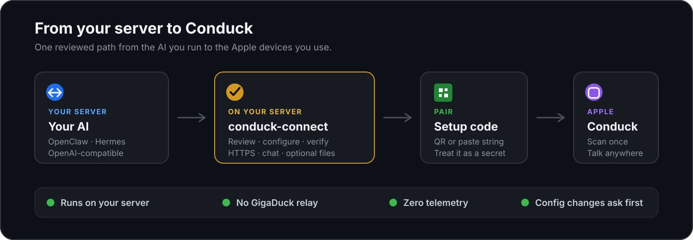

<p align="center">
  
</p>

<h1 align="center">conduck-connect</h1>

<p align="center"><strong>Connect your self-hosted AI to Conduck — without guessing at HTTPS, compatibility, or file transfer.</strong></p>

<p align="center">
  The setup and diagnostics tool that runs on your own Mac or Linux server.<br />
  It reviews the route, verifies the real AI, and gives you a setup code to scan in Conduck.
</p>

<p align="center">
  <a href="https://github.com/gigaduckai/conduck-connect/releases/latest"></a>
  <a href="https://github.com/gigaduckai/conduck-connect/actions/workflows/ci.yml"></a>
  <a href="LICENSE"></a>
</p>

<p align="center">
  <a href="#audit-first-quick-start">Quick start</a>
  ·
  <a href="https://conduck.com/setup/">Setup guide</a>
  ·
  <a href="MANUAL.md">Full manual</a>
  ·
  <a href="https://conduck.com">Get Conduck</a>
</p>



`conduck-connect` is the companion setup tool for [Conduck](https://conduck.com), the native Apple client for your own AI. Run it on the machine where your AI server lives — a VPS, home server, or always-on Mac — not on your iPhone.

It works with **OpenClaw**, **Hermes**, and other servers that expose an OpenAI-compatible chat API. The released tool is one plain-text script assembled from the readable modules in [`src/`](src/), with no telemetry or GigaDuck-operated relay.

## Choose your path

| I want to… | Start with | What it does |
|---|---|---|
| **Pair my AI with Conduck** | `bash conduck-connect.sh --setup` | Reviews the gateway, helps with trusted HTTPS, optionally sets up file transfer, verifies the real route, and prints a setup code |
| **Check existing OpenAI-compatible software** | `bash conduck-connect.sh --check-server <url>` | Grades the behavior the Conduck app needs without changing host configuration |
| **Validate an adapter built for Conduck** | `bash conduck-connect.sh --check-adapter <url>` | Grades the stricter published [adapter contract](https://conduck.com/setup/adapter/v1/) |

Not sure whether your software is an adapter? If it was not written specifically for Conduck, use `--check-server`. A generic server can work perfectly with the app while legitimately failing the stricter adapter check.

## Audit-first quick start

Download the latest **published release** to disk:

```bash
curl -fsSLO https://github.com/gigaduckai/conduck-connect/releases/latest/download/conduck-connect.sh
```

Preview setup on this host without changing anything:

```bash
bash conduck-connect.sh --setup --dry-run
```

The dry run prompts for no secrets, mints no credentials, sends no requests, and emits no setup code. It ends by printing the exact command for the real run.

When you are ready:

```bash
bash conduck-connect.sh --setup
```

Setup is interactive. It shows the relevant action and asks before changing gateway configuration, user-owned configuration, or network exposure. A successful run ends in a QR code and the same setup string as text; scan or paste either one in Conduck.

No `chmod` is needed. The script supports Bash 3.2 or later on macOS and Linux.

Prefer the shortest path? This downloads the complete file and then opens its welcome menu:

```bash
curl -fsSLO https://github.com/gigaduckai/conduck-connect/releases/latest/download/conduck-connect.sh && bash conduck-connect.sh
```

For a version-pinned download, checksum verification, and a guide to reviewing the source by concern rather than linearly, see [Read it before you run it](MANUAL.md#read-it-before-you-run-it).

## What setup handles

1. **Find your AI server.** Detect OpenClaw or Hermes, or use another OpenAI-compatible endpoint you name.
2. **Make the route usable from Apple devices.** Review an existing trusted HTTPS address or choose among the supported Tailscale and Cloudflare paths.
3. **Optionally add full file transfer.** Expose a shared folder through a small WebDAV server so the app and your agent can exchange complete files.
4. **Verify the real path.** Test models, chat, image handling, authentication where applicable, and — when configured — the file lane and the agent's access to it.
5. **Create the setup code.** Print the reusable QR/paste credential only after the selected route has been reviewed and verified.

The tool can also list, edit, and remove setups that already exist. It never installs an AI gateway, Tailscale, `cloudflared`, or `rclone` for you.

## Trust model

| Concern | What conduck-connect does |
|---|---|
| **Telemetry** | Sends none. There is no GigaDuck server in the path |
| **Configuration changes** | Shows and asks before changing gateway, user-owned, or exposure configuration |
| **Network exposure** | Names the route and its consequences; refuses to publish a keyless gateway unless you explicitly use the expert override |
| **Secrets** | Never saves the gateway token; file-server credentials are stored with restricted permissions where the platform allows |
| **Traffic** | Sends probes only to the gateway and file server you named. Tailscale or Cloudflare commands you choose may contact those vendors |
| **Cleanup** | Tracks bounded setup/check artifacts by exact name and reports anything it cannot prove it removed |

The script also creates limited bookkeeping and verification artifacts as part of actions you explicitly choose. [WHAT-IT-TOUCHES.md](WHAT-IT-TOUCHES.md) is the exhaustive inventory of every file, service, port, request, and undo path.

The setup code is a credential, not a receipt. It contains the gateway token and, when configured, the file-server credential. Treat every QR, screenshot, and pasted copy like a password.

## Common commands

| Command | Purpose |
|---|---|
| `bash conduck-connect.sh` | Open the welcome menu |
| `bash conduck-connect.sh --setup` | Go directly to interactive setup |
| `bash conduck-connect.sh --setup --dry-run` | Preview what setup would do without secrets, requests, or changes |
| `bash conduck-connect.sh --check-server [url]` | Check software not built specifically for Conduck |
| `bash conduck-connect.sh --check-adapter [url]` | Check software implementing the Conduck adapter contract |
| `bash conduck-connect.sh --list` | Show saved setups and file-server state without printing secrets |
| `bash conduck-connect.sh --edit [id]` | Change one field and reverify what it affects |
| `bash conduck-connect.sh --forget <id>` | Remove one setup after you confirm by typing its id |
| `bash conduck-connect.sh --help` | Show every command, option, environment variable, and exit status |

`--forget` never deletes the shared folder, the AI server, or the pairing already stored on an Apple device. It does remove the connector-owned setup, credentials, file-server service, and provably associated Tailscale routes it lists before confirmation.

The [full command reference](MANUAL.md#public-commands-and-flags) covers `--show-code`, reuse-only setup, model selection, file checks, machine-readable inventory, exit statuses, and expert flags.

## Checking servers and adapters

Both checks send real requests to the URL you provide. They may consume paid model quota or enter that server's own history, but they do not change host configuration.

```bash
# Existing software not built for Conduck
CONDUCK_TOKEN="$TOKEN" bash conduck-connect.sh --check-server http://127.0.0.1:11434

# An adapter built specifically for Conduck
CONDUCK_TOKEN="$TOKEN" bash conduck-connect.sh --check-adapter http://127.0.0.1:8080
```

Pass bearer credentials through `CONDUCK_TOKEN`, never on the command line where another process could see them through `ps`. Export `CONDUCK_TOKEN=` explicitly for a keyless target.

For an unattended check, add `CI=1`. Without it, a passing check in an interactive terminal offers to continue into setup and pairing.

`--check-adapter --files` is intentionally mutating: it writes and removes small, randomized, exactly named artifacts in the configured shared folder and asks the agent to create its own output. See the [adapter check](MANUAL.md#check-your-own-adapter---check-adapter), [server check](MANUAL.md#testing-existing-openai-software---check-server), and [machine-driving contract](AGENTS.md#for-ai-tools-driving-this-script) before automating them.

## Requirements

- macOS or Linux
- Bash 3.2+
- `curl`
- `python3`
- `openssl`

Interactive setup needs a real terminal and ends with a QR code a person scans. There is intentionally no unattended answer file or `--yes` flag. Fully machine-driven operations are limited to the documented checks and `--list --json`.

Conduck accepts an `https://` gateway address whose certificate the Apple device already trusts — or a plain `http://` one when the address is a local-network one nothing outside can reach, which is how a server such as Ollama answers by default. A domain name over plain `http://` is refused however private the machine behind it is, and so is a bare one-word name such as `nas`: Apple decides that from the address before it connects, so the wizard refuses it too rather than mint a code that would fail on the phone. An IP address, or the same machine's `.local` name, is the spelling that works. The wizard explains the supported routes; the [full manual](MANUAL.md#reaching-your-gateway) covers Tailscale, Tailscale Funnel, Cloudflare Tunnel, reverse proxies, existing HTTPS, and the local-network case.

## Full documentation

- [Operator manual](MANUAL.md) — prompt controls, source review, saved configuration, setup management, complete command reference, checks, HTTPS, manual WebDAV, and troubleshooting.
- [What it touches](WHAT-IT-TOUCHES.md) — every file, service, port, network request, and undo path.
- [Pairing payload](PAYLOAD.md) — the versioned `conduck-setup:v1` wire format.
- [Security](SECURITY.md) — threat model, credential handling, private vulnerability reporting.
- [AI and automation contract](AGENTS.md#for-ai-tools-driving-this-script) — which actions a machine may drive and where a human must take over.
- [Contributing](CONTRIBUTING.md) — source layout, invariants, tests, release process, and DCO.

## Troubleshooting

The [complete troubleshooting guide](MANUAL.md#troubleshooting) is keyed to the exact messages the tool prints. It covers certificate failures, redirects, missing API paths, authentication, model selection, image handling, OpenClaw and Hermes configuration, WebDAV behavior, and setup recovery.

### File-lane problems

A successful WebDAV byte test proves transport, not that the agent can use the folder. The file server must expose the exact workspace the agent reads and writes, and the agent's own tools and policy must permit that access.

If chat works but uploaded files are invisible, generated files never return, PDFs are answered from filenames, or attachments fail only on a standalone Watch, start with the [file-lane troubleshooting section](MANUAL.md#file-lane-problems). Re-running setup performs the end-to-end sentinel for every gateway kind; `--check-adapter --files` is only the right independent check for software built to the Conduck adapter contract.

## Setup code

The QR and paste string contain the same reusable credential:

```text
conduck-setup:v1:<base64(JSON)>
```

It remains valid until you rotate the secrets it carries. The complete format and compatibility rules are in [PAYLOAD.md](PAYLOAD.md); the handling requirements are in [SECURITY.md](SECURITY.md#the-setup-code-is-a-secret).

## For contributors

The maintainable source is the numbered modules under [`src/`](src/), concatenated in `src/manifest.txt` order into the generated `conduck-connect.sh` artifact. Edit a module, never the root script. CI rejects drift between them.

**Release boundary.** The Quick start downloads the latest published release, not `main`. This checkout's source is at `v0.15.0`. The [releases page](https://github.com/gigaduckai/conduck-connect/releases) is the authority on what users can download.

See [CONTRIBUTING.md](CONTRIBUTING.md) before changing the tool.

## Reporting a problem

Open a GitHub issue for bugs or setup questions, or ask in the [Conduck Discord](https://conduck.com/discord/). Report security vulnerabilities privately through the process in [SECURITY.md](SECURITY.md), not through a public issue.

## License

`conduck-connect` is licensed under [Apache-2.0](LICENSE). The embedded Project Nayuki QR Code generator remains under its MIT license; see [THIRD_PARTY_NOTICES.md](THIRD_PARTY_NOTICES.md).

The Conduck name is not covered by the code license. [TRADEMARKS.md](TRADEMARKS.md) explains permitted references and fork identity.
